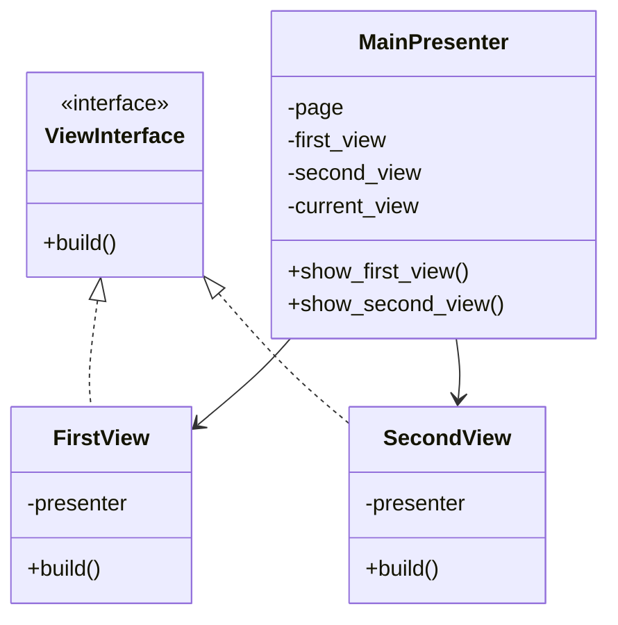
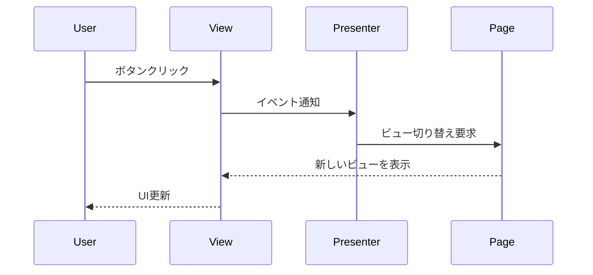
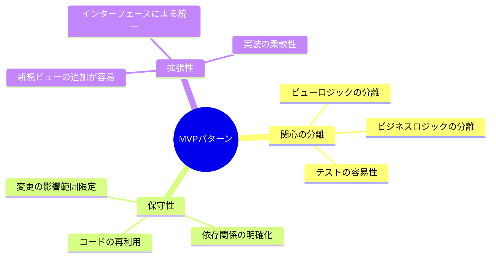

# MVP Pattern

## クラス図

## 処理フロー

## MVPパターンの恩恵

## 説明

1. **構造的な特徴**:
   - `ViewInterface` を通じて一貫したビューの実装を強制
   - Presenter がビューとロジックの橋渡しを担当
   - 各コンポーネントの責務が明確

2. **処理フロー**:
   - ユーザーアクションはすべてPresenterを経由
   - ビューは表示のみに専念
   - Presenterがビジネスロジックを制御

3. **主な利点**:
   - テストが容易（ビューとロジックが分離）
   - コードの再利用性が高い
   - 新機能追加時の影響範囲が限定的
