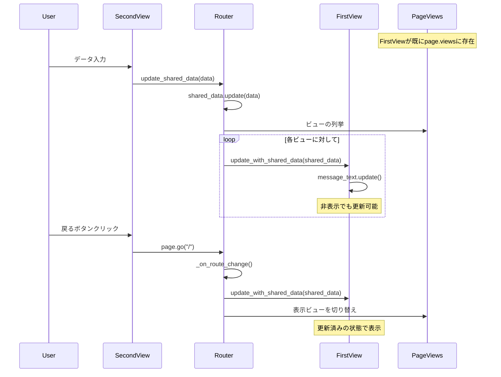

# ビューのシーケンス図

```mermaid
sequenceDiagram
    participant User
    participant SecondView
    participant Router
    participant FirstView
    participant PageViews

    Note over PageViews: FirstViewが既にpage.viewsに存在

    User->>SecondView: データ入力
    SecondView->>Router: update_shared_data(data)
    Router->>Router: shared_data.update(data)

    Router->>PageViews: ビューの列挙
    loop 各ビューに対して
        Router->>FirstView: update_with_shared_data(shared_data)
        FirstView->>FirstView: message_text.update()
        Note over FirstView: 非表示でも更新可能
    end

    User->>SecondView: 戻るボタンクリック
    SecondView->>Router: page.go("/")
    Router->>Router: _on_route_change()
    Router->>FirstView: update_with_shared_data(shared_data)
    Router->>PageViews: 表示ビューを切り替え
    Note over FirstView: 更新済みの状態で表示
```
